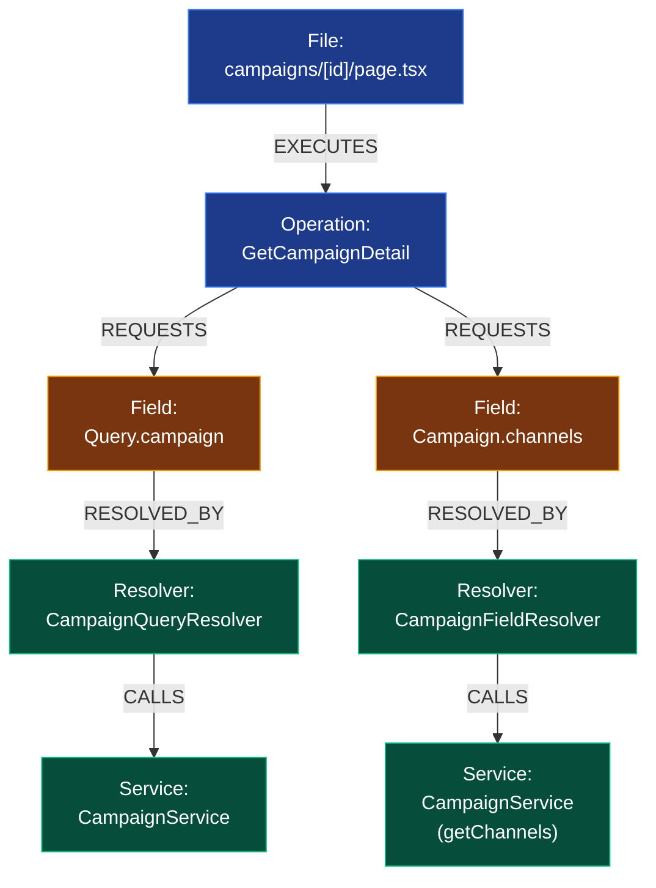
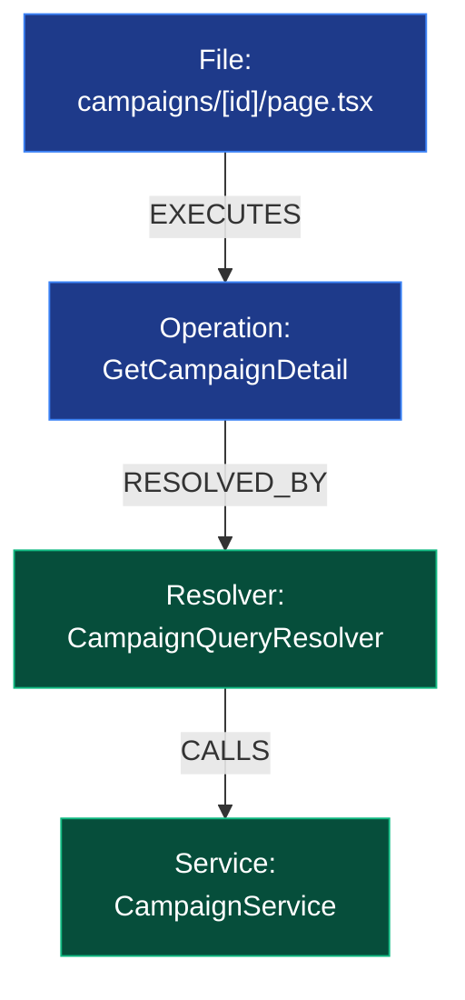

# Semantic Graph Examples: Field-Wise vs Root-Only

This document provides a side-by-side comparison of two approaches to building the Semantic Graph, based on a real query in the application.

## The Scenario

Assume `src/app/campaigns/[id]/page.tsx` executes this query:

```graphql
query GetCampaignDetail($id: ID!) {
  campaign(id: $id) {
    id
    name
    budget
    channels {
      id
      name
    }
  }
}
```

---

## Example 1: Field-Wise Matching (Recommended)

This is the correct approach. It traverses the nested fields (`campaign` -> `channels`), correctly discovering that `channels` is resolved by a separate field resolver which relies on `ChannelService`. 

*(Note: Line breaks `<br/>` are used in the nodes below to prevent text clipping in the viewer.)*



---

## Example 2: Root-Only Matching (Flawed)

This demonstrates what happens if you try to link the Operation directly to the Root Query name and stop there. 

Because we stop at `Query.campaign`, we **completely lose** the fact that the frontend is asking for `channels`, and therefore we completely lose the dependency on the `CampaignFieldResolver`.



### Why Example 2 is flawed:
In Example 2, if a backend engineer modifies the logic for fetching channels in `CampaignFieldResolver`, the graph will **not** show that `campaigns/[id]/page.tsx` is affected, because the edge to the channels resolver is missing entirely. This makes the graph unreliable for impact analysis.
