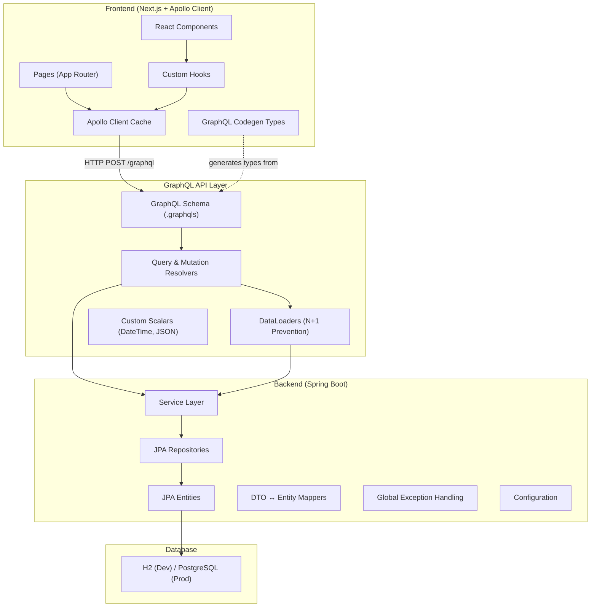
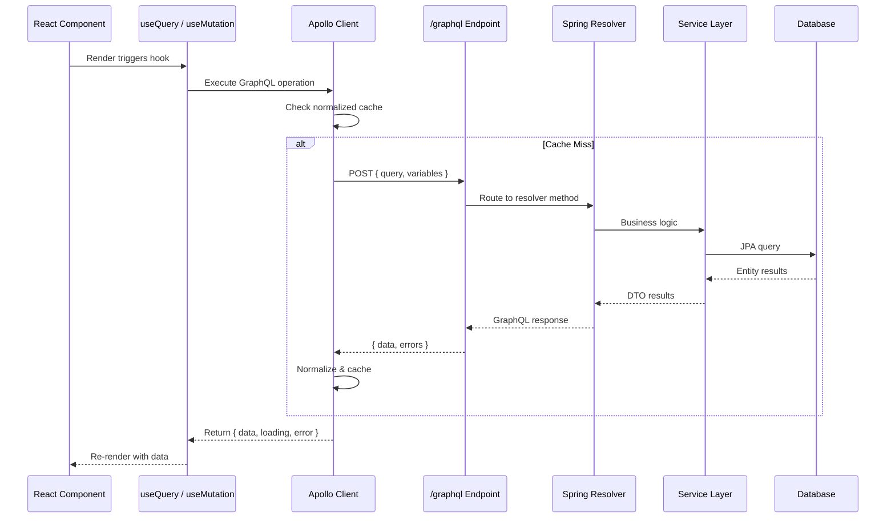

# Nexus CXM — Unified Customer Experience Management Platform

A corporate-grade full-stack platform inspired by Sprinklr's domain. **Nexus CXM** provides a unified dashboard for managing customers, social media channels, campaigns, analytics, and team collaboration — all powered by a **GraphQL API**.

## Domain Overview

| Module | Description |
|---|---|
| **Customers** | CRM-style customer profiles with contact info, tags, segments |
| **Channels** | Social media channel connections (Twitter, Instagram, Facebook, etc.) |
| **Campaigns** | Marketing campaigns with status tracking, scheduling, budgets |
| **Analytics** | Engagement metrics, sentiment analysis, performance dashboards |
| **Teams** | User/team management with roles and permissions |
| **Messages** | Unified inbox for cross-channel customer messages |

---

## System Architecture (GraphQL-Centric)



### How GraphQL Connects Frontend ↔ Backend



---

## Tech Stack

### Backend
| Technology | Purpose |
|---|---|
| Java 17 | Language |
| Spring Boot 3.2 | Application framework |
| Spring for GraphQL | GraphQL server (schema-first) |
| Spring Data JPA | ORM / Data access |
| H2 Database | Embedded dev database |
| Lombok | Boilerplate reduction |
| MapStruct | Entity ↔ DTO mapping |
| Maven | Build tool |
| GraphiQL | Built-in GraphQL IDE |

### Frontend
| Technology | Purpose |
|---|---|
| Next.js 14 | React framework (App Router) |
| TypeScript 5 | Type safety |
| Apollo Client 3 | GraphQL client + cache |
| GraphQL Codegen | Auto-generate TS types from schema |
| CSS Modules | Scoped styling |
| Recharts | Data visualization |
| Lucide React | Icons |

---

## Proposed Changes

### Backend — `b:\projects\test\backend\`

#### Project Structure
```
backend/
├── pom.xml
├── README.md
├── src/
│   └── main/
│       ├── java/com/nexus/cxm/
│       │   ├── NexusCxmApplication.java
│       │   ├── config/
│       │   │   ├── GraphQLConfig.java
│       │   │   ├── CorsConfig.java
│       │   │   └── DataSeeder.java
│       │   ├── scalar/
│       │   │   └── DateTimeScalarConfig.java
│       │   ├── exception/
│       │   │   ├── ResourceNotFoundException.java
│       │   │   ├── BusinessValidationException.java
│       │   │   └── GraphQLExceptionHandler.java
│       │   ├── model/
│       │   │   ├── entity/
│       │   │   │   ├── Customer.java
│       │   │   │   ├── Channel.java
│       │   │   │   ├── Campaign.java
│       │   │   │   ├── CampaignChannel.java
│       │   │   │   ├── Message.java
│       │   │   │   ├── EngagementMetric.java
│       │   │   │   ├── Team.java
│       │   │   │   └── User.java
│       │   │   └── dto/
│       │   │       ├── input/
│       │   │       │   ├── CreateCustomerInput.java
│       │   │       │   ├── UpdateCustomerInput.java
│       │   │       │   ├── CreateCampaignInput.java
│       │   │       │   ├── UpdateCampaignInput.java
│       │   │       │   ├── CreateMessageInput.java
│       │   │       │   ├── CustomerFilterInput.java
│       │   │       │   ├── CampaignFilterInput.java
│       │   │       │   └── MessageFilterInput.java
│       │   │       ├── payload/
│       │   │       │   ├── CustomerPayload.java
│       │   │       │   ├── CampaignPayload.java
│       │   │       │   ├── ChannelPayload.java
│       │   │       │   ├── MessagePayload.java
│       │   │       │   ├── EngagementMetricPayload.java
│       │   │       │   ├── TeamPayload.java
│       │   │       │   ├── UserPayload.java
│       │   │       │   ├── AnalyticsSummaryPayload.java
│       │   │       │   └── DashboardPayload.java
│       │   │       └── connection/
│       │   │           ├── PageInfo.java
│       │   │           ├── Connection.java
│       │   │           └── Edge.java
│       │   ├── mapper/
│       │   │   ├── CustomerMapper.java
│       │   │   ├── CampaignMapper.java
│       │   │   ├── ChannelMapper.java
│       │   │   ├── MessageMapper.java
│       │   │   └── UserMapper.java
│       │   ├── repository/
│       │   │   ├── CustomerRepository.java
│       │   │   ├── ChannelRepository.java
│       │   │   ├── CampaignRepository.java
│       │   │   ├── CampaignChannelRepository.java
│       │   │   ├── MessageRepository.java
│       │   │   ├── EngagementMetricRepository.java
│       │   │   ├── TeamRepository.java
│       │   │   └── UserRepository.java
│       │   ├── service/
│       │   │   ├── CustomerService.java
│       │   │   ├── ChannelService.java
│       │   │   ├── CampaignService.java
│       │   │   ├── MessageService.java
│       │   │   ├── AnalyticsService.java
│       │   │   ├── TeamService.java
│       │   │   └── UserService.java
│       │   ├── resolver/
│       │   │   ├── query/
│       │   │   │   ├── CustomerQueryResolver.java
│       │   │   │   ├── ChannelQueryResolver.java
│       │   │   │   ├── CampaignQueryResolver.java
│       │   │   │   ├── MessageQueryResolver.java
│       │   │   │   ├── AnalyticsQueryResolver.java
│       │   │   │   └── TeamQueryResolver.java
│       │   │   ├── mutation/
│       │   │   │   ├── CustomerMutationResolver.java
│       │   │   │   ├── CampaignMutationResolver.java
│       │   │   │   └── MessageMutationResolver.java
│       │   │   └── field/
│       │   │       ├── CustomerFieldResolver.java
│       │   │       ├── CampaignFieldResolver.java
│       │   │       ├── ChannelFieldResolver.java
│       │   │       └── MessageFieldResolver.java
│       │   └── dataloader/
│       │       ├── DataLoaderRegistrar.java
│       │       ├── CustomerDataLoader.java
│       │       └── ChannelDataLoader.java
│       └── resources/
│           ├── application.yml
│           ├── graphql/
│           │   ├── schema.graphqls          # Root schema
│           │   ├── customer.graphqls
│           │   ├── channel.graphqls
│           │   ├── campaign.graphqls
│           │   ├── message.graphqls
│           │   ├── analytics.graphqls
│           │   ├── team.graphqls
│           │   └── common.graphqls          # Pagination, scalars, enums
│           └── data.sql                      # Seed data
```

> [!IMPORTANT]
> The GraphQL schema files (`.graphqls`) are the **single source of truth** for the API contract. Both backend resolvers and frontend codegen derive from these schemas.

---

### Frontend — `b:\projects\test\frontend\`

#### Project Structure
```
frontend/
├── package.json
├── tsconfig.json
├── next.config.js
├── codegen.ts
├── README.md
├── public/
│   └── assets/
├── src/
│   ├── app/
│   │   ├── layout.tsx
│   │   ├── page.tsx                        # Dashboard
│   │   ├── globals.css
│   │   ├── customers/
│   │   │   ├── page.tsx
│   │   │   └── [id]/page.tsx
│   │   ├── campaigns/
│   │   │   ├── page.tsx
│   │   │   └── [id]/page.tsx
│   │   ├── channels/
│   │   │   └── page.tsx
│   │   ├── messages/
│   │   │   └── page.tsx
│   │   ├── analytics/
│   │   │   └── page.tsx
│   │   └── teams/
│   │       └── page.tsx
│   ├── components/
│   │   ├── layout/
│   │   │   ├── Sidebar.tsx
│   │   │   ├── Sidebar.module.css
│   │   │   ├── Header.tsx
│   │   │   ├── Header.module.css
│   │   │   ├── AppShell.tsx
│   │   │   └── AppShell.module.css
│   │   ├── ui/
│   │   │   ├── Button.tsx
│   │   │   ├── Button.module.css
│   │   │   ├── Card.tsx
│   │   │   ├── Card.module.css
│   │   │   ├── DataTable.tsx
│   │   │   ├── DataTable.module.css
│   │   │   ├── Badge.tsx
│   │   │   ├── Badge.module.css
│   │   │   ├── Modal.tsx
│   │   │   ├── Modal.module.css
│   │   │   ├── Spinner.tsx
│   │   │   ├── Spinner.module.css
│   │   │   ├── EmptyState.tsx
│   │   │   ├── Pagination.tsx
│   │   │   ├── Pagination.module.css
│   │   │   ├── StatusIndicator.tsx
│   │   │   └── StatusIndicator.module.css
│   │   ├── customers/
│   │   │   ├── CustomerList.tsx
│   │   │   ├── CustomerDetail.tsx
│   │   │   ├── CustomerForm.tsx
│   │   │   └── CustomerCard.tsx
│   │   ├── campaigns/
│   │   │   ├── CampaignList.tsx
│   │   │   ├── CampaignDetail.tsx
│   │   │   ├── CampaignForm.tsx
│   │   │   └── CampaignTimeline.tsx
│   │   ├── channels/
│   │   │   ├── ChannelGrid.tsx
│   │   │   └── ChannelCard.tsx
│   │   ├── messages/
│   │   │   ├── MessageInbox.tsx
│   │   │   ├── MessageThread.tsx
│   │   │   └── MessageComposer.tsx
│   │   ├── analytics/
│   │   │   ├── EngagementChart.tsx
│   │   │   ├── SentimentGauge.tsx
│   │   │   ├── MetricCard.tsx
│   │   │   └── PerformanceGrid.tsx
│   │   └── dashboard/
│   │       ├── DashboardStats.tsx
│   │       ├── RecentActivity.tsx
│   │       └── QuickActions.tsx
│   ├── graphql/
│   │   ├── queries/
│   │   │   ├── customers.ts
│   │   │   ├── campaigns.ts
│   │   │   ├── channels.ts
│   │   │   ├── messages.ts
│   │   │   ├── analytics.ts
│   │   │   └── dashboard.ts
│   │   ├── mutations/
│   │   │   ├── customers.ts
│   │   │   ├── campaigns.ts
│   │   │   └── messages.ts
│   │   └── fragments/
│   │       ├── customer.ts
│   │       ├── campaign.ts
│   │       └── message.ts
│   ├── lib/
│   │   ├── apollo-client.ts
│   │   ├── apollo-provider.tsx
│   │   └── constants.ts
│   ├── hooks/
│   │   ├── useCustomers.ts
│   │   ├── useCampaigns.ts
│   │   ├── useChannels.ts
│   │   ├── useMessages.ts
│   │   ├── useAnalytics.ts
│   │   └── usePagination.ts
│   ├── types/
│   │   └── index.ts
│   └── generated/
│       └── graphql.ts                      # Auto-generated by codegen
```

---

## GraphQL Schema Design (Key Excerpts)

### Relay-Style Pagination
```graphql
type PageInfo {
  hasNextPage: Boolean!
  hasPreviousPage: Boolean!
  startCursor: String
  endCursor: String
}

type CustomerConnection {
  edges: [CustomerEdge!]!
  pageInfo: PageInfo!
  totalCount: Int!
}

type CustomerEdge {
  node: Customer!
  cursor: String!
}
```

### Root Query & Mutation
```graphql
type Query {
  # Customers
  customers(first: Int, after: String, filter: CustomerFilterInput): CustomerConnection!
  customer(id: ID!): Customer
  
  # Campaigns  
  campaigns(first: Int, after: String, filter: CampaignFilterInput): CampaignConnection!
  campaign(id: ID!): Campaign
  
  # Channels
  channels: [Channel!]!
  channel(id: ID!): Channel
  
  # Messages
  messages(first: Int, after: String, filter: MessageFilterInput): MessageConnection!
  
  # Analytics
  analyticsSummary(channelId: ID, startDate: DateTime, endDate: DateTime): AnalyticsSummary!
  dashboard: Dashboard!
}

type Mutation {
  createCustomer(input: CreateCustomerInput!): Customer!
  updateCustomer(id: ID!, input: UpdateCustomerInput!): Customer!
  deleteCustomer(id: ID!): Boolean!
  
  createCampaign(input: CreateCampaignInput!): Campaign!
  updateCampaign(id: ID!, input: UpdateCampaignInput!): Campaign!
  
  sendMessage(input: CreateMessageInput!): Message!
  markMessageRead(id: ID!): Message!
}
```

---

## Key Design Patterns

| Pattern | Where | Why |
|---|---|---|
| **Schema-First GraphQL** | Backend `.graphqls` files | Schema is the contract; resolvers implement it |
| **Relay Pagination** | Connections/Edges/PageInfo | Industry-standard cursor-based pagination |
| **DataLoaders** | N+1 query prevention | Batch & cache DB calls per request |
| **DTO ↔ Entity Separation** | Mappers layer | Decouple API shape from DB schema |
| **Custom Hooks** | Frontend `hooks/` | Encapsulate GraphQL operations per domain |
| **Apollo Normalized Cache** | Frontend `apollo-client.ts` | Automatic cache updates on mutations |
| **GraphQL Codegen** | `codegen.ts` | Generate TypeScript types from schema |
| **CSS Modules** | `*.module.css` | Scoped styles, no class name collisions |
| **Fragment Colocation** | `graphql/fragments/` | Reusable field selections across queries |

---

## Verification Plan

### Automated
- Backend: `mvn spring-boot:run` — verify server starts on port 8080
- Backend: Access GraphiQL at `http://localhost:8080/graphiql` — run sample queries
- Frontend: `npm run dev` — verify dev server starts on port 3000
- Frontend: `npm run build` — verify production build succeeds with no TS errors
- Verify frontend connects to backend GraphQL endpoint

### Manual
- Navigate all pages in the frontend
- Execute queries and mutations via GraphiQL
- Verify pagination, filtering, and error states
