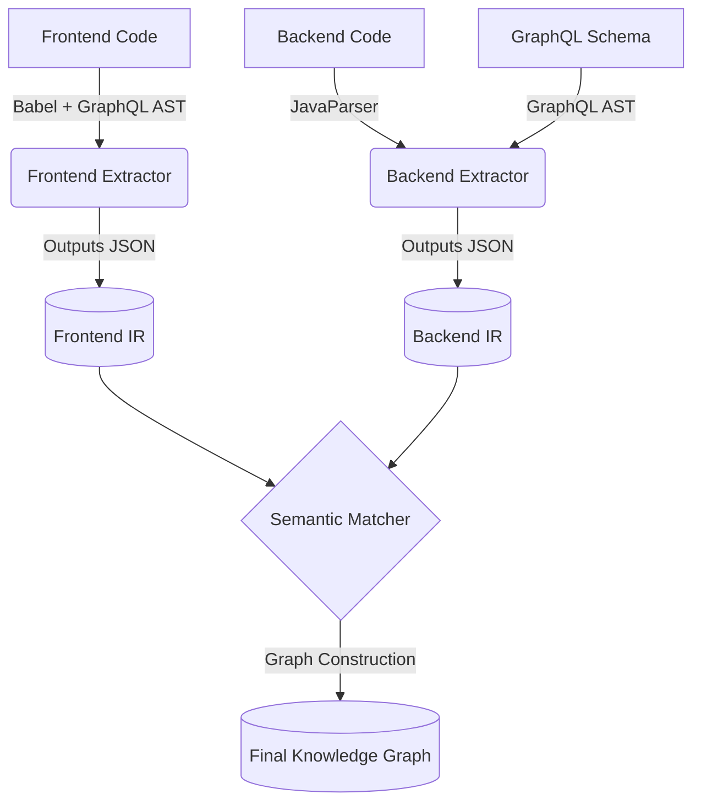

# Semantic Graph System Architecture & Approach

This document outlines the architecture, API contracts, and step-by-step approach for building the Cross-Repo Semantic Graph System. Treat this system as a **compiler pipeline** rather than a typical visualization tool.

---

## 1. System Overview (The Compiler Pipeline)

The system is broken down into three decoupled components. They do not talk to each other directly; they communicate via JSON **Intermediate Representations (IR)**.



> [!IMPORTANT]
> **Decoupling is critical.** The Matcher should have zero knowledge of how to parse TypeScript or Java. It should only operate on the clean IR JSON generated by the Extractors.

---

## 2. API Contract: The Intermediate Representation (IR)

The IR is the JSON schema that your Extractors must produce. This forms the contract between extraction and matching.

### Frontend IR Contract
This represents what the frontend *requests*.

```typescript
// frontend-ir.json
{
  "operations": [
    {
      "operationName": "GetDashboardStats",
      "operationType": "query", 
      "sourceFile": "src/app/page.tsx",
      "rootFields": [
        {
          "name": "analytics",
          "alias": "dashboardStats",
          "children": [
            { "name": "totalUsers", "children": [] },
            { "name": "activeCampaigns", "children": [] }
          ]
        }
      ]
    }
  ]
}
```

### Backend IR Contract
This represents what the backend *provides* and *how* it resolves it.

```typescript
// backend-ir.json
{
  "schema": {
    "Query": {
      "analytics": { "type": "AnalyticsSummary" },
      "customers": { "type": "[Customer]" }
    },
    "AnalyticsSummary": {
      "totalUsers": { "type": "Int" },
      "activeCampaigns": { "type": "Int" }
    }
  },
  "resolvers": [
    {
      "parentType": "Query",
      "fieldName": "analytics",
      "resolverClass": "AnalyticsQueryResolver",
      "resolverMethod": "analytics",
      "callsServices": ["AnalyticsService.getMetrics"]
    }
  ]
}
```

---

## 3. The Matching Strategy (The Merging Script)

The Matcher's job is to take a Frontend `operation` and traverse its `rootFields`. As it traverses, it uses the Backend `schema` to keep track of the current type context, allowing it to link fields to `resolvers`.

### The Algorithm:
1. Start at a Frontend Root Field (e.g., `analytics`).
2. Current Type Context = `Query`.
3. Look up `Query.analytics` in Backend Resolvers. 
   - *Result: Found `AnalyticsQueryResolver`.* -> **DRAW EDGE**
4. Look up `Query.analytics` in Backend Schema to find its return type.
   - *Result: Returns `AnalyticsSummary`.*
5. Move to Frontend Child Field (e.g., `totalUsers`).
6. New Type Context = `AnalyticsSummary`.
7. Look up `AnalyticsSummary.totalUsers` in Backend Resolvers.
   - *Result: No specific field resolver found. Assume default entity resolution.*

---

## 4. How to Proceed: Step-by-Step Implementation Guide

### Step 1: Build the Frontend Extractor (Node.js)
* **Goal**: Generate `frontend-ir.json`.
* **Tools**: `@babel/parser`, `@babel/traverse`, `graphql`.
* **Approach**:
  1. Write a script to glob all `.tsx` and `.ts` files.
  2. Parse each file using Babel.
  3. Traverse the Babel AST looking for `TaggedTemplateExpression` where the tag name is `gql`.
  4. Extract the template literal string.
  5. Pass that string to `graphql.parse()`.
  6. Walk the GraphQL AST to build the recursive `children` tree.
  7. Save as JSON.

### Step 2: Build the Backend Extractor (Java or Node.js)
* **Goal**: Generate `backend-ir.json`.
* **Tools**: `graphql-js` (for parsing `.graphqls` files), `JavaParser` (for Java analysis).
* **Approach**:
  1. Parse `schema.graphqls` using `graphql-js` to build the Type Map (knowing which fields belong to which types).
  2. Parse the Java source code in `src/main/java`.
  3. Look for classes with `@Controller`.
  4. Look for methods with `@QueryMapping` (implies parent type is `Query`) or `@SchemaMapping` (implies parent type is specified by the annotation).
  5. Look inside the method body for method calls ending in `Service`.
  6. Save as JSON.

### Step 3: Build the Graph Matcher & Builder
* **Goal**: Combine IRs and output a GraphML or Cypher format.
* **Approach**:
  1. Load both JSON files.
  2. Execute the matching algorithm detailed in section 3.
  3. Maintain a set of Nodes and a set of Edges.
  4. Generate final output format.

> [!TIP]
> **Start Small**: Focus *strictly* on Phase 1 (Frontend Extractor) first. Try to parse just one file (e.g., `src/app/page.tsx`) and successfully print its Operation name and nested fields to the console before worrying about the backend.
